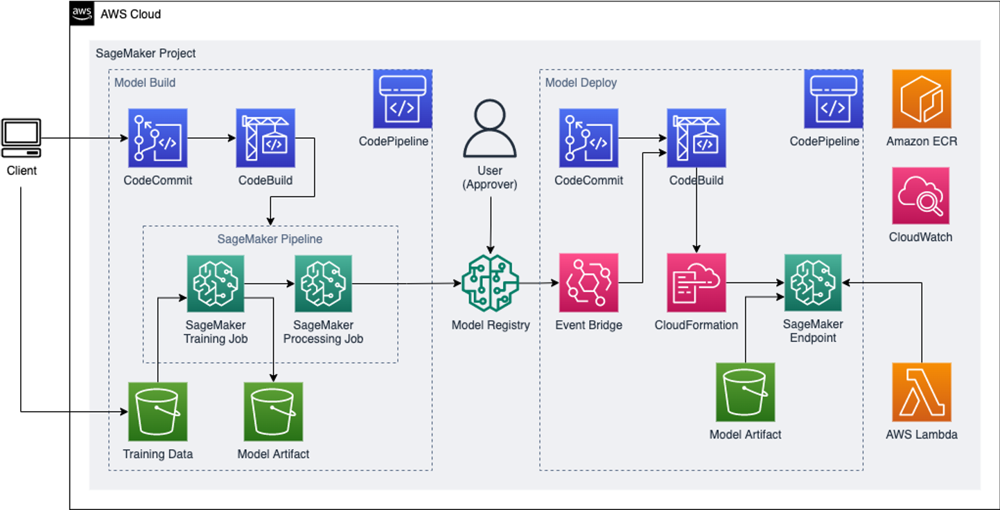

## AutoGluon Model and SageMaker Pipeline

This senario performs model development using the Binary Classification model of Autogluon and then builds the MLOps architecture using SageMaker Pipelines from the customer's account. All implementations are directly done by the customer and the issues that arise during the course of the program are shared by the SAs in charge and supported by debugging.

## Security

See [CONTRIBUTING](CONTRIBUTING.md#security-issue-notifications) for more information.

## License

This library is licensed under the MIT-0 License. See the LICENSE file.

